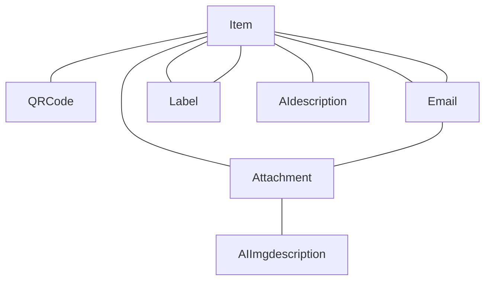
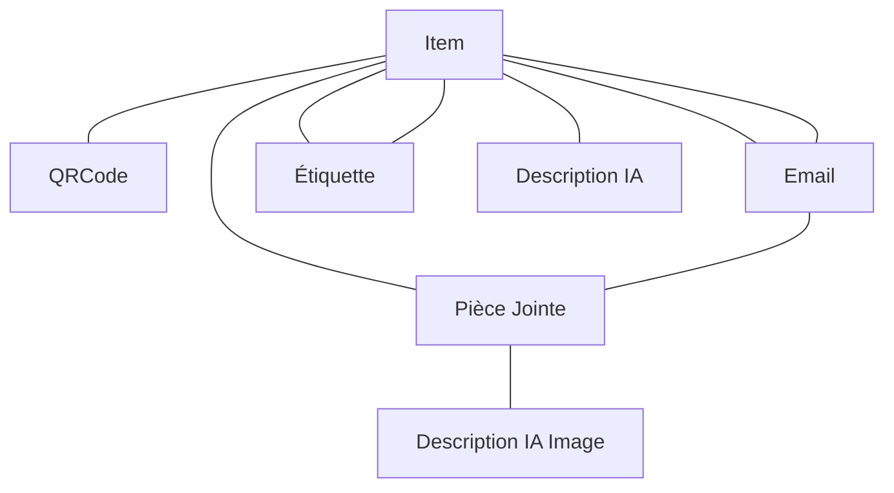

# Inventory Management System | Système de Gestion d'Inventaire

[English](#english) | [Français](#français)

## English

A sophisticated Django-based inventory management system that leverages AI for image analysis, processes emails with QR codes, and provides a modern HTMX-enhanced interface.

### Core Features

  #### Inventory Management
  - **QR Code Integration**
    - Automatic QR code extraction from emails (5-digit format)
    - Multiple QR codes per item with uniqueness validation
    - QR code management through API endpoints
  
  #### AI-Powered Analysis
  - **Image Analysis (LLaVA)**
    - Object detection and description generation
    - Text and barcode extraction from images
    - Configurable through `generate_llava_descriptions` command
  
  - **Text Processing (Qwen)**
    - Aggregated description synthesis
    - Technical specification extraction
    - Consistency verification across descriptions
  
  #### Email Processing
    - **Two-Pass System**
      - First pass: New items (5-digit subjects)
      - Second pass: Updates (re: format)
      - Attachment handling with metadata extraction
      - Email threading support
  
  #### Modern Interface
    - **HTMX Integration**
      - Real-time search functionality
      - Dynamic modal views
      - Instant label management
      - Live content updates
  
  #### Technical Stack
    - Django 5.1
    - Django REST Framework
    - HTMX for frontend interactivity
    - DRF Spectacular for API documentation
    - Django Filters for search capabilities

### API Endpoints
  
  #### Items
    - List/Create: `/api/items/`
    - Detail/Update/Delete: `/api/items/{id}/`
    - Add QR Code: `/api/items/{id}/add_qr_code/`
    - Add Label: `/api/items/{id}/add_label/`
  
  #### Emails
    - List/Create: `/api/emails/`
    - Detail/Update/Delete: `/api/emails/{id}/`
    - Process Unhandled: `/api/emails/process_unhandled/`
  
  #### QR Codes & Labels
    - QR Codes: `/api/qrcodes/`
    - Labels: `/api/labels/`
  
  #### Attachments
    - List/Upload: `/api/attachments/`
    - Detail/Update/Delete: `/api/attachments/{id}/`

### Installation

  #### Environment Setup
  ```bash
    python -m venv venv
    source venv/bin/activate  # Unix
    .\venv\Scripts\activate   # Windows
  
    pip install -r requirements.txt
    ```
  
  #### Environment Configuration (.env):
  ```bash
    DJANGO_SECRET_KEY=your-secret-key-here
    DEBUG=True
    ALLOWED_HOSTS=localhost,127.0.0.1
    DB_NAME=inventory_db
    DB_USER=postgres
    DB_PASSWORD=postgres
    DB_HOST=db
    DB_PORT=5432
    MEDIA_ROOT=/app/media
    MEDIA_URL=/media/
    MAX_UPLOAD_SIZE=5242880
  ```
  
  #### AI Services Configuration:
    -**LLaVA Server**
      ```bash
      LLAVA_SERVER_URL=http://192.168.1.112:1234
      ```
  
    -**Qwen Server**
      ```bash
      QWEN_SERVER_URL=http://host.docker.internal:1234
      ```
  
  #### Management Commands
    -**Email Processing**
      -Fetch emails
      ```bash
      python manage.py fetch_emails
      ```
  
      -Process items
      ```bash
      python manage.py process_items --verbose
      ```
  
  #### AI Analysis
    -**Generate image descriptions**
      ```bash
      python manage.py generate_llava_descriptions
      ```
    
    -**Process text analysis**
      ```bash
      python manage.py process_qwen_analysis
      ```

### Data Model



## Français
Un système sophistiqué de gestion d'inventaire basé sur Django, utilisant l'IA pour l'analyse d'images, le traitement d'emails avec codes QR, et offrant une interface moderne avec HTMX.

### Fonctionnalités Principales

#### Gestion d'Inventaire
  -**Intégration QR Code**
    -Extraction automatique des codes QR des emails (format 5 chiffres)
    -Support multiple de codes QR par article avec validation d'unicité
    -Gestion des codes QR via points d'accès API

#### Analyse par IA
  -**Analyse d'Images (LLaVA)**
    -Détection d'objets et génération de descriptions
    -Extraction de texte et codes-barres des images
    -Configurable via la commande generate_llava_descriptions

  -**Traitement de Texte (Qwen)**
    -Synthèse de descriptions agrégées
    -Extraction de spécifications techniques
    -Vérification de cohérence entre descriptions

  -**Traitement des Emails**
    -Système en Deux Passes
    -Première passe : Nouveaux articles (sujets à 5 chiffres)
    -Seconde passe : Mises à jour (format re:)
    -Gestion des pièces jointes avec extraction de métadonnées
    -Support du threading des emails

  -**Interface Moderne**
    -Intégration HTMX
    -Recherche en temps réel
    -Vues modales dynamiques
    -Gestion instantanée des étiquettes
    -Mises à jour dynamiques du contenu
  
  -**Stack Technique**
    -Django 5.1
    -Django REST Framework
    -HTMX pour l'interactivité frontend
    -DRF Spectacular pour la documentation API
    -Django Filters pour les capacités de recherche
  
### Points d'Accès API

  -**Articles**
      Liste/Création : /api/items/
      Détail/Mise à jour/Suppression : /api/items/{id}/
      Ajout Code QR : /api/items/{id}/add_qr_code/
      Ajout Étiquette : /api/items/{id}/add_label/
    
  -**Emails**
      Liste/Création : /api/emails/
      Détail/Mise à jour/Suppression : /api/emails/{id}/
      Traitement Non-gérés : /api/emails/process_unhandled/
    
  -**Codes QR & Étiquettes**
      Codes QR : /api/qrcodes/
      Étiquettes : /api/labels/
    
  -**Pièces Jointes**
      Liste/Téléchargement : /api/attachments/
      Détail/Mise à jour/Suppression : /api/attachments/{id}/
    
### Installation
    1.Configuration de l'Environnement :
  
      ```bash
      python -m venv venv
      source venv/bin/activate  # Unix
      .\venv\Scripts\activate   # Windows
      ```  
    2.Dépendances :
  
      ```bash
      pip install -r requirements.txt
      ```
  
  #### Configuration Environnement (.env) :
  
    ```bash
    DJANGO_SECRET_KEY=votre-clé-secrète
    DEBUG=True
    ALLOWED_HOSTS=localhost,127.0.0.1
    DB_NAME=inventory_db
    DB_USER=postgres
    DB_PASSWORD=postgres
    DB_HOST=db
    DB_PORT=5432
    MEDIA_ROOT=/app/media
    MEDIA_URL=/media/
    MAX_UPLOAD_SIZE=5242880
    ```
  
  #### Configuration Services IA :
    -**Serveur LLaVA**
        ```bash
        LLAVA_SERVER_URL=http://localhost:1234
        ```
  
    -**Serveur Qwen**
        ```bash
        QWEN_SERVER_URL=http://host.docker.internal:1234
        ```

### Commandes de Gestion

  #### Traitement des Emails
    -**Récupération des emails**
        ```bash
        python manage.py fetch_emails
        ```
    
    -**Traitement des articles**
        ```bash
        python manage.py process_items --verbose
      ```
  
  #### Analyse IA
  
    -**Génération des descriptions d'images**
      ```bash 
      python manage.py generate_llava_descriptions 
      ```
  
    -**Traitement analyse textuelle**
      ```bash 
      python manage.py process_qwen_analysis
      ```

### Modèle de Données


