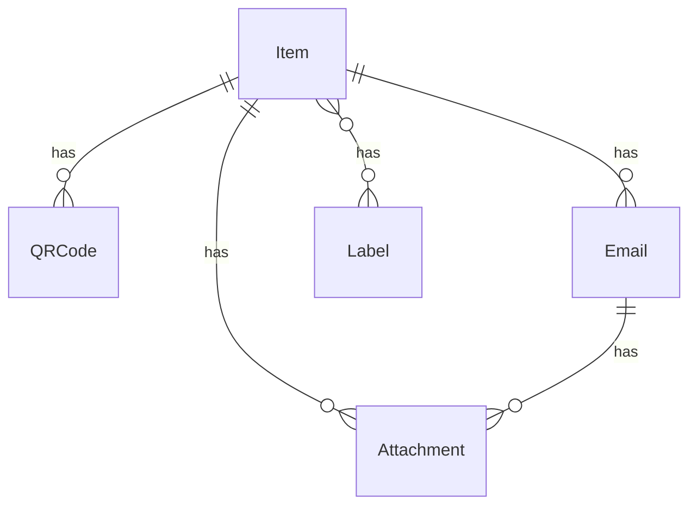

# Inventory Management System

A Django-based inventory management system that creates and tracks items based on email content. The system processes emails with QR codes to automatically create and manage inventory items, handle attachments, and maintain relationships between items and their documentation.

## Features

- **Email-Based Item Creation**
  - Automatically fetch emails via IMAP with attachments
  - Create items from emails containing QR codes
  - Handle email attachments with proper metadata
  - Support for email threading and updates

- **QR Code Management**
  - Unique QR code assignment to items
  - Multiple QR codes per item support
  - QR code validation and uniqueness checks

- **Attachment System**
  - Support for email attachments
  - Manual file uploads
  - Automatic file metadata extraction
  - Image and PDF detection

- **RESTful API**
  - Complete CRUD operations for all resources
  - Search and filtering capabilities
  - Nested resource serialization

## Installation

### Prerequisites
- Docker and Docker Compose
- Python 3.x (if running locally)
- PostgreSQL (if running locally)

### Setup

1. Clone the repository:
```bash
git clone <repository-url>
cd inventory-system
```

2. Create `.env` file from example:
```bash
cp .env.example .env
# Edit .env with your configurations
```

3. Build and start services:
```bash
docker-compose up --build
```

The system will automatically:
- Initialize the database
- Run migrations
- Create necessary directories
- Start the development server

## Usage

### API Endpoints

All endpoints are available at `http://localhost:8000/api/`

#### Items
- List/Create: [http://localhost:8000/api/items/](http://localhost:8000/api/items/)
- Detail/Update/Delete: [http://localhost:8000/api/items/{id}/](http://localhost:8000/api/items/{id}/)
- Add QR Code: [http://localhost:8000/api/items/{id}/add_qr_code/](http://localhost:8000/api/items/{id}/add_qr_code/)
- Add Label: [http://localhost:8000/api/items/{id}/add_label/](http://localhost:8000/api/items/{id}/add_label/)

#### Emails
- List/Create: [http://localhost:8000/api/emails/](http://localhost:8000/api/emails/)
- Detail/Update/Delete: [http://localhost:8000/api/emails/{id}/](http://localhost:8000/api/emails/{id}/)
- Process Unhandled: [http://localhost:8000/api/emails/process_unhandled/](http://localhost:8000/api/emails/process_unhandled/)

#### QR Codes
- List/Search: [http://localhost:8000/api/qrcodes/](http://localhost:8000/api/qrcodes/)
- Detail: [http://localhost:8000/api/qrcodes/{id}/](http://localhost:8000/api/qrcodes/{id}/)

#### Labels
- List/Create: [http://localhost:8000/api/labels/](http://localhost:8000/api/labels/)
- Detail/Update/Delete: [http://localhost:8000/api/labels/{id}/](http://localhost:8000/api/labels/{id}/)

#### Attachments
- List/Upload: [http://localhost:8000/api/attachments/](http://localhost:8000/api/attachments/)
- Detail/Update/Delete: [http://localhost:8000/api/attachments/{id}/](http://localhost:8000/api/attachments/{id}/)

### Management Commands

#### Fetch Emails
Fetches emails from IMAP server with attachments:
```bash
# Basic usage
docker-compose exec web python manage.py fetch_emails

# With custom thread count and batch size
docker-compose exec web python manage.py fetch_emails --threads 8 --batch-size 100
```

#### Process Items
Process fetched emails to create inventory items:
```bash
# Dry run (see what would happen)
docker-compose exec web python manage.py process_items --dry-run --verbose

# Actually process emails
docker-compose exec web python manage.py process_items --verbose
```

### Email Processing Rules

The system processes emails in two passes:

1. **First Pass (New Items)**
   - Subject must be exactly 5 digits (whitespace is removed)
   - Creates new item if QR code doesn't exist
   - Example valid subjects: "12345", "1 2 3 4 5"

2. **Second Pass (Updates)**
   - Subject must start with 're' (case insensitive)
   - Must contain a 5-digit QR code
   - Examples:
     - `re:12345` - Valid
     - `re 12345` - Valid
     - `RE: 12345` - Valid

### File Upload Limits

- Maximum file size: 5MB
- Supported content types:
  - Images (detected automatically)
  - PDFs (detected automatically)
  - Other attachments stored with original content type

## Data Model Relationships



Key constraints:
- Items must have at least one QR code
- QR codes are unique across the system
- Items cannot be deleted if they would lose their last QR code
- Attachments survive email deletion (SET_NULL)

## Development

### Environment Variables

Required for basic operation (in `.env`):
```bash
DJANGO_SECRET_KEY=your-secret-key-here
DEBUG=True
ALLOWED_HOSTS=localhost,127.0.0.1
DB_NAME=inventory_db
DB_USER=postgres
DB_PASSWORD=postgres
DB_HOST=db
DB_PORT=5432
MEDIA_ROOT=/app/media
MEDIA_URL=/media/
MAX_UPLOAD_SIZE=5242880
```

### Dependencies

See `requirements.txt` for full list. Key dependencies:
- Django >= 3.2,<4.0
- djangorestframework >= 3.12,<4.0
- django-filter >= 2.4,<3.0
- Pillow >= 8.0,<9.0
- python-magic >= 0.4,<1.0

## File Storage

Files are stored in the `media/` directory, which is:
- Created automatically if missing
- Mounted as a Docker volume
- Preserved between container restarts

